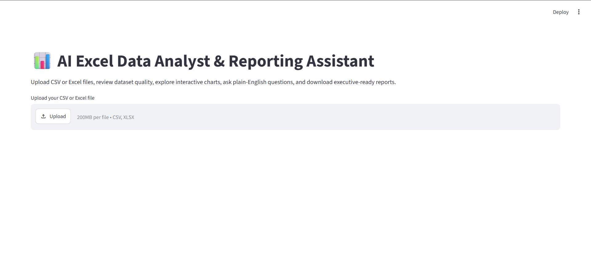
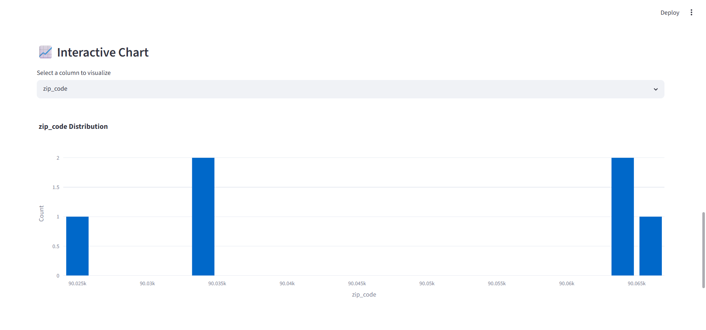
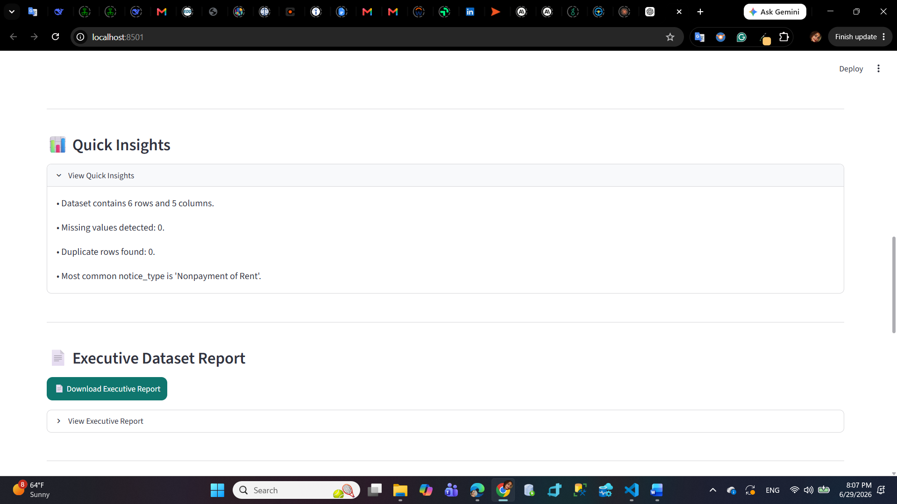
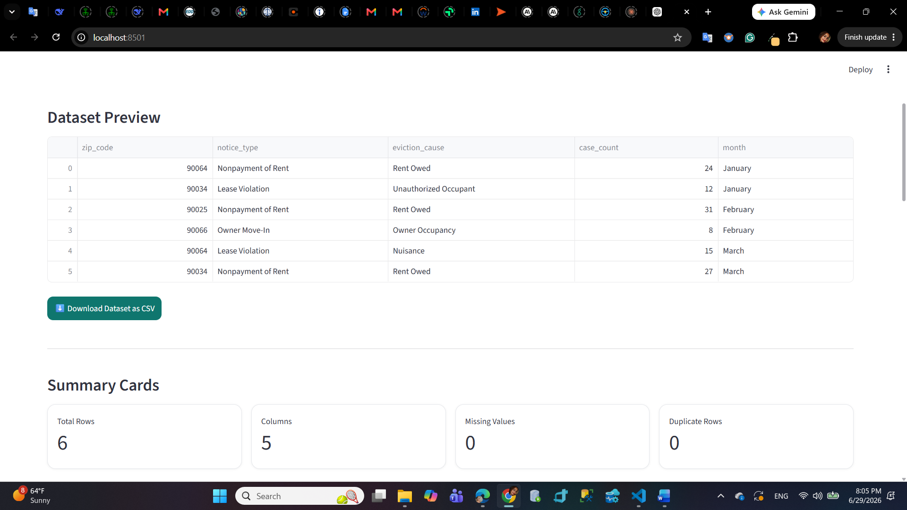

# 📊 AI Excel Data Analyst & Reporting Assistant

An interactive data analysis web application built with Python and Streamlit that helps users analyze CSV and Excel datasets without writing code.

## Features

- Upload CSV and Excel files
- Dataset preview
- Dataset health check
- Summary statistics
- Interactive charts
- Natural language dataset Q&A
- Download AI-generated answers
- Executive report generation
- Dataset profile report
- Download cleaned dataset

## Technologies

- Python
- Pandas
- Streamlit
- Plotly
- OpenPyXL

## Screenshots

### Home



### Interactive Chart



### Dataset Q&A



### Executive Report



## Live Demo

(https://ai-excel-data-analyst-reporting-assistant.streamlit.app/)

## Installation

```bash
pip install -r requirements.txt

streamlit run app.py
```

## Sample Dataset

A sample housing dataset is included for demonstration purposes.

## Future Improvements

- AI-powered insights using LLMs
- PDF report generation
- Automatic chart recommendations
- Data cleaning suggestions

## Author

Ellie Nia